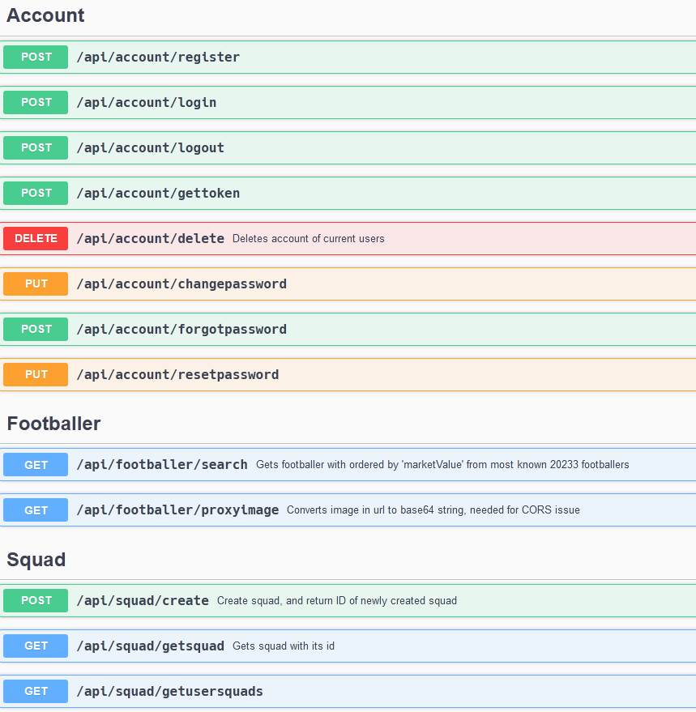
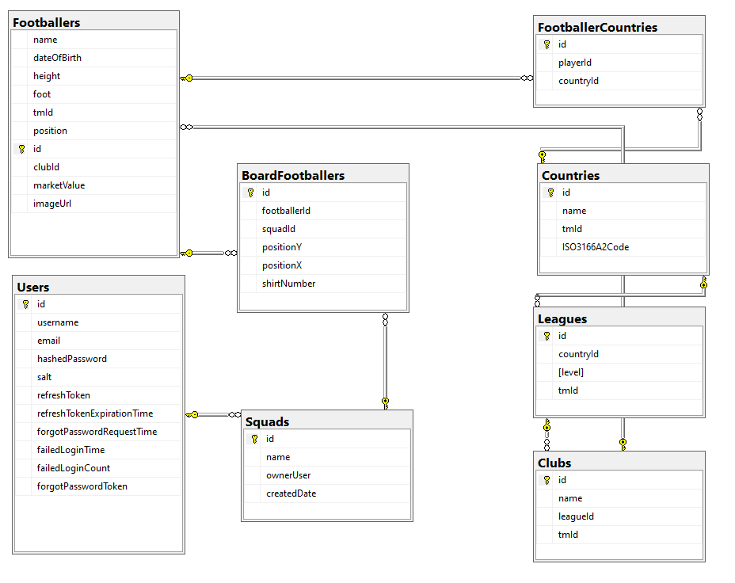

# README
This is ASP.NET Core Web API for FootballSquad app.

## Features
* CRUD operations on different entities with Dapper.
* Onion architecture
* Custom Account system.
* Custom User auth system with JWT.
* Email service with Gmail.

## Required Config
```
ConnectionStrings__Footballers=
JwtSecretKey=
Gmail_Email=
Gmail_Password=
Auth__Jwt__Issuer=
Auth__Jwt__Audience=
ReactAppDomain=
```

## API Overview



## Database
Database is MSSQL DB. It is located in football_squad_database.zip file.
Attach it to server and make sure to grant write access:
```sql
ALTER DATABASE Footballers SET READ_WRITE;
```

### Database Diagram
